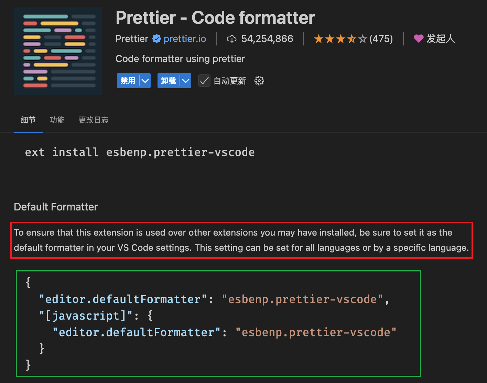
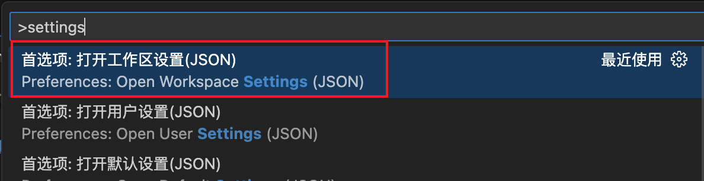

标题：前端项目最佳实践

关键点：

1. eslint/prettier 插件和安装包区别

> 要在界面中实时的看到语法检查信息，必须安装好 npm 相应的库，以及安装好 vscode 中的`eslint` 插件，二者缺一不可。

> prettier 插件可以配置在编辑器中单独使用（配置好配置文件即可）；也可以配置在打包工具中，通过命令运行打包工具时，会自动格式化代码。

- 安装包可以在开发构建时（配合打包工具-webpack/vite）
  - 在控制台输出具体-->根据规则阻断编译
  - 在开发页面直接显示错误信息--->无法正常开发

2. 打包工具（webpack/vite）对应的插件

- babel-loader
- eslint-loader
- prettier-loader
- ts-loader

3. 配置文件优先级

- 配置文件（高）
- vscode 目录（中）
- vscode 配置（低）

## babel

## prettier

> 不用安装 npm 库，直接下载好插件并配置好配置文件即可使用

```json
{
  "singleQuote": true,
  "semi": true,
  "tabWidth": 2,
  "useTabs": false,
  "bracketSpacing": true,
  "arrowParens": "avoid",
  "printWidth": 80,
  "endOfLine": "auto",
  "eslintIntegration": false
}
```

### 使用步骤

1. vscode 插件市场下载 prettier
2. 在工作区设置 prettier 为默认格式化插件，
   
   将图中的配置复制到`.vscode/settings.json`文件中

   ```json
   {
     "editor.defaultFormatter": "esbenp.prettier-vscode",
     "[javascript]": {
       "editor.defaultFormatter": "esbenp.prettier-vscode"
     }
   }
   ```

   新建文件可以使用`command+shift+p` 搜索`settings.json` ，选择如下图
   
   ps: 如果要支持其他语言/框架，则需要在`settings.json`中配置对应语言的配置

3. 配置补充

- `"files.autoSave": "onFocusChange"` 配置自动保存
- `"editor.formatOnSave": true` 配置保存后进行格式化
- `"prettier.configPath": ".prettierrc"` 配置 prettier 配置文件路径（兜底，防止未读到配置文件）
- `"prettier.enable": true` 开启 prettier 配置（兜底，防止禁用了 prettier）

4. 配置`.prettierrc` 配置文件

   ```json
   {
     "singleQuote": true,
     "semi": true,
     "tabWidth": 2,
     "useTabs": false,
     "bracketSpacing": true,
     "arrowParens": "avoid",
     "printWidth": 80,
     "endOfLine": "auto",
     "eslintIntegration": false
   }
   ```

## eslint

> 要在界面中实时的看到语法检查信息，必须安装好 npm 相应的库，以及安装好 vscode 中的`eslint` 插件，二者缺一不可。

如果安装好了`eslint` 插件，配置好了`.eslintrc.xxx` 配置文件，开启了

```javascript
module.exports = {
  env: {
    // browser: true, // 允许在浏览器环境下使用 console
    node: true, // 允许在 Node.js 环境下使用 console，允许本文件可以使用esmudule模块化
    es2021: true, // 启用 ES2021 语法
  },
  rules: {
    'no-console': 'off',
    'no-unused-vars': ['warn'], // 警告未使用的变量
    'no-undef': 'error', // 禁止使用未声明的变量
    'prefer-const': 'warn', // 能用 `const` 的地方就不要用 `let`
    'no-var': 'error', // 禁止使用 var
    'no-multiple-empty-lines': ['error', { max: 1 }], // 限制连续空行数
    eqeqeq: ['warn', 'always'], // 要求使用 === 而不是 ==
  },
}
```

## typescript
